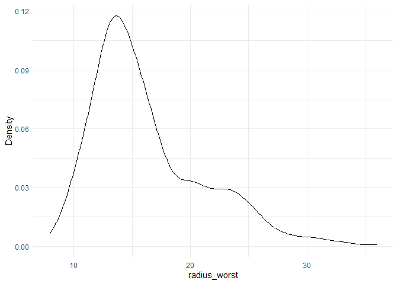

Assignment_B_1
================
Chunyu Wang
2023-11-03

## Setup

Begin by loading MDA Deliverable 1,2 data and the relevant package
below:

``` r
library(datateachr)
library(ggplot2)
library(tidyverse)
library(testthat) 
library(dplyr) 
library(roxygen2)
```

## Exercise 1 & 2:Making a function & Documenting my function

``` r
#' @title   create_density_plot
#' @description  This function produces a density plot for a numeric attribute within a dataframe using ggplot2. 
#' The function requires the attribute to be passed as a symbol, reflecting the column name in the dataframe.
#' @param dataframe  A dataframe with data to plot. 
#' It is named as dataframe bacause it is required to pass the main set of data from which information will be drawn.
#' @param attribute  A symbol representing the numeric column in the dataframe to be used for the density plot.
#' It is named as attribute bacause it refers to a specific column of the data.
#' 
#' @return  A ggplot object representing the density plot.
#' @export
#'
#' @examples
#' # Correct usage:
#' create_density_plot(cancer_sample, radius_mean)
#' # Incorrect usage (will result in an error):
#' create_density_plot(cancer_sample, "radius_mean")
create_density_plot <- function(dataframe, attribute) {
  
  
  if (is.character(substitute(attribute))) {
    stop("[Error] Attribute should be a symbol but not a string!\n")
  }
  
  attribute_as_string <- deparse(substitute(attribute)) # convert variable name as string.
  
  if (all(is.na(dataframe[[attribute_as_string]]))) {
    stop("[Error] The attribute contains no data.\n")
  }
  # https://stackoverflow.com/questions/14577412/how-to-convert-variable-object-name-into-string
  
  if (!attribute_as_string %in% names(dataframe)) {
    stop(paste("[Error] The attribute", attribute_as_string, "does not exist in the dataframe!\n"))
  }

  if (!is.numeric(dataframe[[attribute_as_string]])) {
    stop(paste("[Error] The attribute", attribute_as_string, "must be numeric!\n"))
  }

  density_plot <- ggplot(dataframe, aes(x = {{ attribute }})) +
    geom_density(na.rm = TRUE) +
    labs(x = attribute_as_string, y = "Density") +
    theme_minimal()

  return(density_plot)
}
```

## Exercise 3: Include examples

**CORRECT Usage**

``` r
radius_worst_density_plot <- create_density_plot(cancer_sample, radius_worst)
print(radius_worst_density_plot)
```

<!-- -->

**INCORRECT Usage Example 1:**

``` r
radius_worst_density_plot <- create_density_plot(cancer_sample, "radius_worst")
```

    ## Error in create_density_plot(cancer_sample, "radius_worst"): [Error] Attribute should be a symbol but not a string!

**INCORRECT Usage Example 2:**

``` r
wrong_plot <- create_density_plot(cancer_sample, diagnosis)
```

    ## Error in create_density_plot(cancer_sample, diagnosis): [Error] The attribute diagnosis must be numeric!

**INCORRECT Usage Example 3:**

``` r
wrong_plot <- create_density_plot(cancer_sample, nonsense)
```

    ## Error in create_density_plot(cancer_sample, nonsense): [Error] The attribute contains no data.

## Exercise 4: Test the Function

**Test 1:** if a ggplot object is returned for valid inputs

``` r
test_that("Density plot is created for valid numeric column", {
  return_value <- create_density_plot(cancer_sample, radius_mean)
  expect_is(return_value, "ggplot")
})
```

    ## Test passed 🎊

**Test 2:** Test if an error is thrown for non-numeric data

``` r
test_that("Error for non-numeric column vector", {
  expect_error(create_density_plot(cancer_sample, diagnosis))
})
```

    ## Test passed 🥇

**Test 3:** Test if an error is thrown for a string parameter input

``` r
test_that("Error when attribute is passed as a string", {
  expect_error(create_density_plot(cancer_sample, "radius_mean"))
})
```

    ## Test passed 😸

**Test 4:** Test for an empty column vector

``` r
test_that("Error when passing attribute with no data", {
  # create an empty column
  cancer_sample$empty_column <- rep(NA, nrow(cancer_sample))
  expect_error(create_density_plot(cancer_sample, empty_column), 
               "The attribute contains no data.")
})
```

    ## Test passed 🎊
